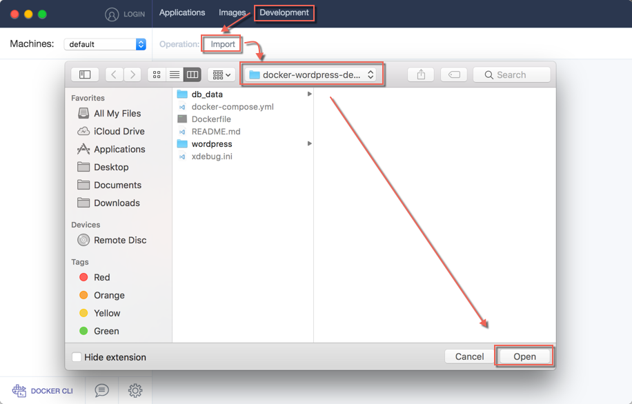
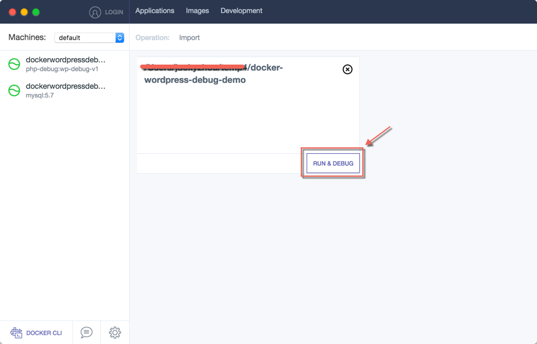
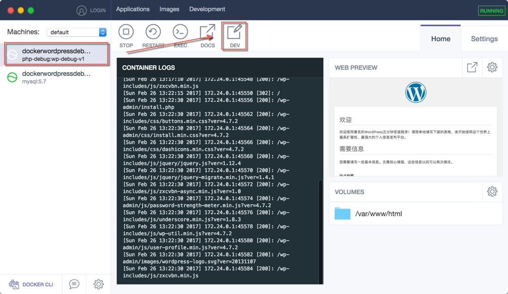
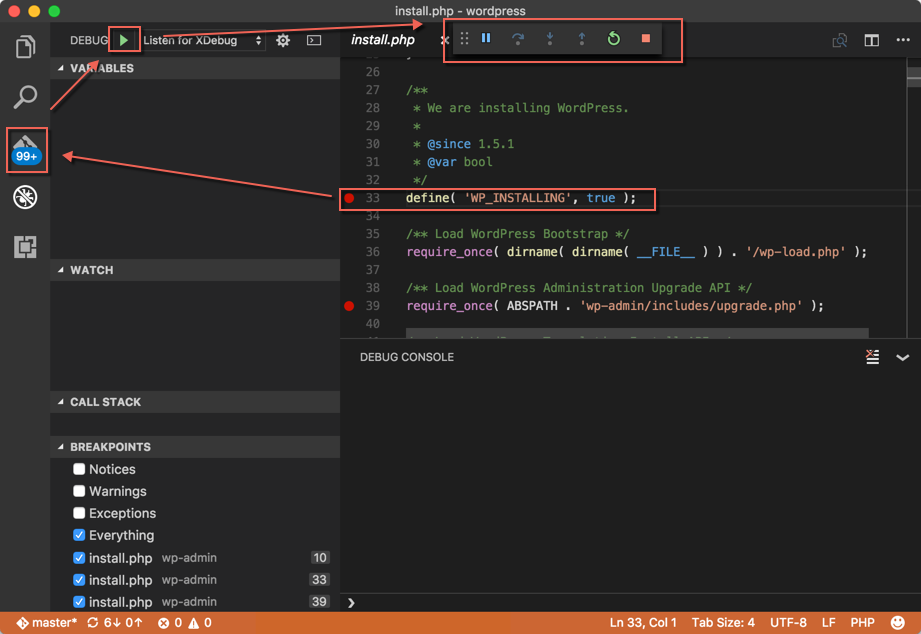
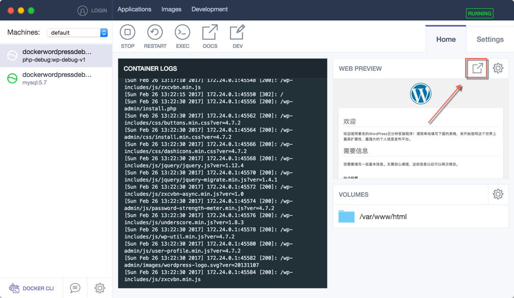
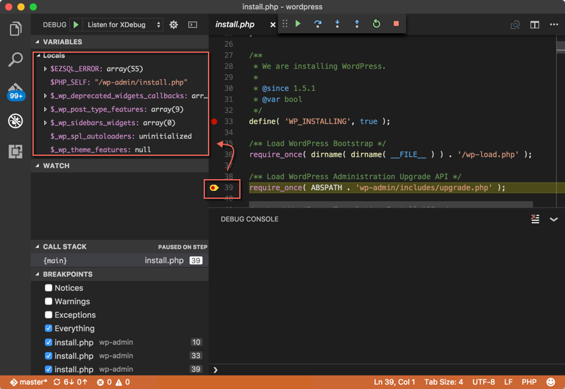

# 使用容器桌面工具开发调试WordPress应用

## 第1步：克隆WordPress代码到客户端本地
git clone https://github.com/lean-soft/docker-wordpress-debug-demo.git

## 第2步：配置xdebug监听IP以及端口
更新项目根目录下的xdebug.ini文件，修改xdebug.remote_host对应的IP为客户端本机IP地址  
例如：xdebug.remote_host=192.168.1.101

## 第3步：导入WordPress项目
打开容器桌面客户端，点击 Development -> Import，选择项目文件夹，点击打开  

## 第4步：运行WordPress开发调试环境
成功导入调试环境后，点击”Run&Debug“按钮 运行Wordpress开发调试环境  

## 第5步：打开WordPress源代码
选择Wordpress应用层对应的容器，并点击DEV按钮（容器桌面客户端会自动帮你使用VSCODE客户端打开Wordpress源代码）

## 第6步：设置应用程序断点，启动DEBUG
选择需要调试的php源文件，设置断点，并启动Xdebug调试工具   
注意：VSCODE客户端需要安装Xdebug插件，如果没有安装请参考链接：https://marketplace.visualstudio.com/items?itemName=felixfbecker.php-debug 

## 第7步：打开wordpress站点，并导航至断点对应的页面进行调试
在容器桌面客户端打开站点，并导航至设置断点的相应php页面

VSCODE捕获到断点，并显示对应变量，开发人员可以进行单步调试

